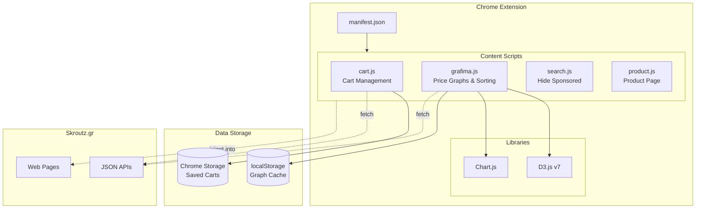

# 🛒 Skroutz Vanced

A powerful Chrome extension that enhances your [Skroutz.gr](https://www.skroutz.gr) shopping experience with price tracking, cart management, and smart filtering.


---

## ✨ Features

| Feature | Description |
|---------|-------------|
| 📊 **Price History Graphs** | View interactive price history charts for any product using D3.js and Chart.js |
| 🛒 **Cart Management** | Save and load multiple shopping carts, empty cart with one click |
| ⚖️ **Shipping Weight Calculator** | Calculate cumulative shipping weights per shop |
| 🚫 **Sponsored Item Removal** | Automatically hides sponsored/promoted products |
| 📈 **Smart Sorting** | Sort products by discount percentage from historical low price |
| 📍 **Nearby Store Filter** | Filter products available at nearby stores |
| 💾 **Graph Caching** | Caches price data in localStorage for faster loading |

---

## 🏗️ Architecture



---

## 📁 Project Structure

```
Skroutz-Vanced/
├── manifest.json          # Extension manifest (v3)
├── README.md              # This file
│
├── src/
│   ├── content-scripts/
│   │   ├── cart.js        # Cart save/load/empty functionality
│   │   ├── grafima.js     # Price graphs, sorting, filtering
│   │   ├── search.js      # Hide sponsored items on search
│   │   └── product.js     # Product page enhancements
│   │
│   ├── lib/
│   │   ├── Chart.js       # Chart.js library
│   │   └── d3.v7.min.js   # D3.js v7 library
│   │
│   └── assets/
│       └── images/
│           ├── delete.png
│           └── deletecart.png
│
└── docs/                  # Documentation (optional)
```

---

## 🚀 Installation

### From Source (Developer Mode)

1. **Clone the repository**
   ```bash
   git clone https://github.com/yourusername/Skroutz-Vanced.git
   ```

2. **Open Chrome Extensions**
   - Navigate to `chrome://extensions/`
   - Enable **Developer mode** (toggle in top-right)

3. **Load the extension**
   - Click **"Load unpacked"**
   - Select the `Skroutz-Vanced` folder

4. **Done!** Visit [skroutz.gr](https://www.skroutz.gr) and enjoy the enhanced features.

---

## 📖 Usage Guide

### Price Graphs
- Navigate to any product listing page
- Price history graphs load automatically
- Green percentage = great deal (close to historical low)
- Click the 📊 button to toggle graph visibility

### Cart Management
On the cart page (`/cart`):
- 💾 **Save** - Save current cart with a custom name
- 📂 **Load** - Load a previously saved cart
- 🗑️ **Empty** - Clear entire cart with one click
- ⚖️ **Weights** - Calculate shipping weights per shop

### Smart Sorting
- Click the ↕️ sort button to reorder products
- Products are sorted by discount from historical low
- Enable auto-sort in settings for automatic sorting

### Nearby Store Filter
- Click the 📍 filter button
- Shows only products available at nearby stores

---

## 🛠️ Technology Stack

| Technology | Purpose |
|------------|---------|
| **JavaScript ES6+** | Core extension logic |
| **Chrome Extensions API** | Browser integration |
| **D3.js v7** | Statistical calculations (mean, median, deviation) |
| **Chart.js** | Interactive price charts |
| **Chrome Storage API** | Persistent cart storage |
| **localStorage** | Graph data caching |

---

## 🔌 API Endpoints Used

The extension fetches data from Skroutz's public JSON APIs:

| Endpoint | Purpose |
|----------|---------|
| `/cart.json` | Get current cart data |
| `/cart/add/{sku_id}.json` | Add item to cart |
| `/cart/remove_line_item/{id}.json` | Remove item from cart |
| `/s/{sku_id}/price_graph.json` | Get price history data |
| `/{category}.json` | Get product listings |

---

## ⚙️ Settings

Settings are stored in `localStorage` under `vanced-graph-settings`:

```javascript
{
  autoLoadGraphs: true,    // Auto-load price graphs
  autoSortProducts: false, // Auto-sort by discount
  limit: -10,              // Threshold for "good deal" (green color)
  autoHideGraphs: false    // Hide graphs by default
}
```

---

## 🤝 Contributing

Contributions are welcome! Please feel free to submit a Pull Request.

1. Fork the repository
2. Create your feature branch (`git checkout -b feature/AmazingFeature`)
3. Commit your changes (`git commit -m 'Add some AmazingFeature'`)
4. Push to the branch (`git push origin feature/AmazingFeature`)
5. Open a Pull Request

---

## 📝 License

This project is licensed under the MIT License - see the [LICENSE](LICENSE) file for details.

---

## ⚠️ Disclaimer

This extension is not affiliated with, endorsed by, or connected to Skroutz S.A. in any way. It is an independent project created to enhance the user experience on the platform.

---

<div align="center">
  Made with ❤️ for smarter shopping
</div>
