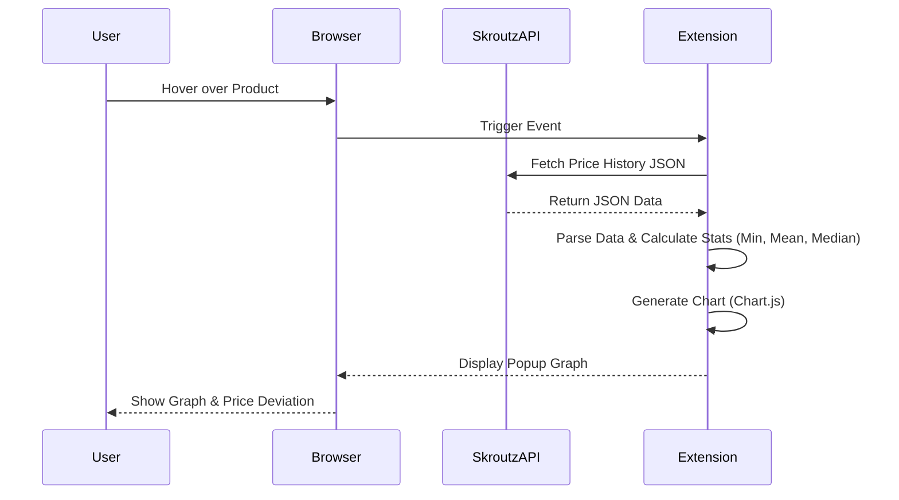
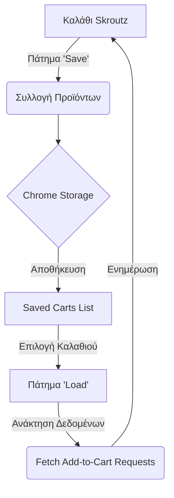

# Skroutz Vanced

Το **Skroutz Vanced** είναι μια επέκταση για τον Chrome που βελτιώνει την εμπειρία πλοήγησης στο Skroutz.gr, προσφέροντας εργαλεία για έξυπνες αγορές, ιστορικό τιμών και διαχείριση καλαθιού.

## 🚀 Χαρακτηριστικά

### 🛒 Διαχείριση Καλαθιού
*   **Αποθήκευση & Φόρτωση:** Αποθηκεύστε την τρέχουσα κατάσταση του καλαθιού σας και φορτώστε την αργότερα με ένα κλικ.
*   **Άδειασμα Καλαθιού:** Κουμπί για γρήγορη διαγραφή όλων των προϊόντων από το καλάθι.
*   **Υπολογισμός Βάρους (Beta):** Πειραματική λειτουργία που υπολογίζει τα μεταφορικά βάρη για τα προϊόντα στο καλάθι.

### 📈 Ανάλυση Τιμών & Γραφήματα
*   **Ιστορικό Τιμών:** Εμφανίζει γραφήματα με την εξέλιξη της τιμής (Μέση τιμή, Διάμεσος, Ελάχιστη τιμή).
*   **Ένδειξη "Best Deal":** Υπολογίζει την απόκλιση της τρέχουσας τιμής από το ιστορικό χαμηλό.
*   **Χρωματική Ένδειξη:** Το ποσοστό έκπτωσης γίνεται πράσινο όταν ξεπερνά ένα όριο που ορίζετε εσείς.
*   **Αυτόματη Φόρτωση:** Επιλογή για αυτόματη εμφάνιση των γραφημάτων.
*   **Popup Γραφήματα:** Τα γραφήματα εμφανίζονται σε αναδυόμενο παράθυρο που μπορείτε να μετακινήσετε.

### 🧹 Καθαρισμός & Ταξινόμηση
*   **Αφαίρεση Sponsored:** Αφαιρεί αυτόματα τα διαφημιζόμενα/sponsored προϊόντα από τις λίστες αναζήτησης.
*   **Έξυπνη Ταξινόμηση:** Ταξινομεί τα προϊόντα με βάση το πόσο συμφέρουσα είναι η τιμή τους σε σχέση με το ιστορικό τους χαμηλό.
*   **Φίλτρο Διαθεσιμότητας:** Φιλτράρει προϊόντα που είναι διαθέσιμα σε κοντινά καταστήματα (εφόσον υποστηρίζεται).

### 🧪 Πειραματικές Λειτουργίες
*   **Σάρωση Σελίδων:** Σαρώνει πολλαπλές σελίδες αναζήτησης για να βρει τα 50 καλύτερα deals.
*   **Today's Best Deals:** Καταγράφει τα καλύτερα deals που είδατε κατά την περιήγησή σας.

---

## 🛠️ Εγκατάσταση

1.  Κατεβάστε τον κώδικα (Code -> Download ZIP) και αποσυμπιέστε τον ή κάντε `git clone` το repository.
2.  Ανοίξτε τον Chrome και πηγαίνετε στη διεύθυνση `chrome://extensions/`.
3.  Ενεργοποιήστε το **Developer mode** (πάνω δεξιά).
4.  Πατήστε **Load unpacked** (Φόρτωση μη συσκευασμένης επέκτασης).
5.  Επιλέξτε τον φάκελο που περιέχει τα αρχεία του project.

---

## 📖 Οδηγίες Χρήσης

### Στις σελίδες αναζήτησης / κατηγοριών
Θα δείτε μια σειρά από νέα κουμπιά πάνω από τη λίστα των προϊόντων:
*   📊 **Εικονίδιο Γραφήματος:** Ενεργοποιεί/Απενεργοποιεί την αυτόματη φόρτωση γραφημάτων.
*   🔢 **Εικονίδιο Ταξινόμησης:** Ταξινομεί τα αποτελέσματα βάσει της πτώσης τιμής.
*   📍 **Εικονίδιο Απόστασης:** Φιλτράρει βάσει διαθεσιμότητας σε κοντινά καταστήματα.
*   🔎 **Εικονίδιο Αναζήτησης (Scan):** Σαρώνει σελίδες για ευκαιρίες.

Μπορείτε επίσης να ορίσετε το όριο (π.χ. -10%) στο πεδίο δίπλα στα κουμπιά, ώστε να πρασινίζει το κείμενο όταν η τιμή είναι 10% κάτω από το ιστορικό χαμηλό.

### Στο Καλάθι
*   💾 **Δισκέτα:** Αποθηκεύει το καλάθι.
*   📂 **Φάκελος:** Φορτώνει αποθηκευμένα καλάθια.
*   🗑️ **Κάδος:** Αδειάζει το καλάθι.
*   ⚖️ **Βαρίδι:** Υπολογίζει βάρη (Beta).

---

## 📊 Διαγράμματα Λειτουργίας

### Ροή Δεδομένων Γραφήματος Τιμής

### Ροή Αποθήκευσης/Φόρτωσης Καλαθιού

---

## ⚠️ Αποποίηση Ευθύνης

Αυτή η επέκταση είναι ένα ανεξάρτητο project και **δεν** σχετίζεται, υποστηρίζεται ή συνδέεται με την επίσημη ιστοσελίδα Skroutz.gr ή την εταιρεία Skroutz Α.Ε. Χρησιμοποιήστε την με δική σας ευθύνη.
